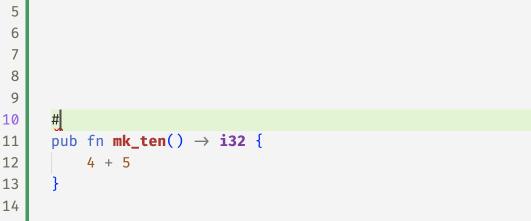
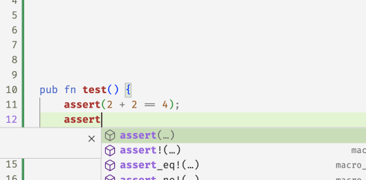
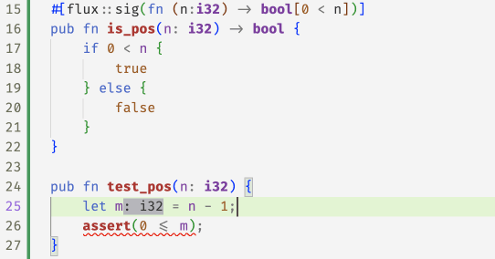
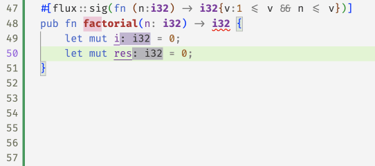

# Introducing Flux

[Online demo](https://flux.programming.systems/?example=refinements.rs)

Types bring order to code. For example, if a variable `i:usize`
then we know `i` is a number that can be used to index a vector.
Similarly, if `v:vec<&str>` then we can be sure that `v` is a
collection of strings which may _be_ indexed but of course,
not used _as_ an index. However, by itself `usize` doesn't
tell us how big or small the number and hence the programmer
must still rely on their own wits, a lot of tests, and a dash
of optimism, to ensure that all the different bits fit properly
at run-time.

[Refinements][jhala-vazou] are a promising new way to extend
type checkers with logical constraints that *specify* additional
correctness requirements that can be *verified* by the compiler,
thereby entirely eliminating various classes of run-time problems.

We're excited to introduce [Flux][flux-github], a refinement type
checker plugin that brings this technology to `Rust`.

<!-- more -->

## Indexed Types

The most basic form of refinement type in `flux` is a type that is
*indexed* by a logical value. For example

| **Type**      | **Meaning**                                          |
|:--------------|:-----------------------------------------------------|
| `i32[10]`     | The (singleton) set of `i32` values equal to `10`    |
| `bool[true]`  | The (singleton) set of `bool` values equal to `true` |


### Post-Conditions

We can already start using these indexed types to start writing (and checking)
code. For example we can write the following specification which says that
the value *returned* by `mk_ten` must in fact be `10`

```rust
#[flux::sig(fn() -> i32[10])]
pub fn mk_ten() -> i32 {
    5 + 4
}
```

but when you compile it, `flux` will say

```bash
error[FLUX]: postcondition might not hold
 --> src/basics.rs:7:5
  |
7 |     5 + 4
  |     ^^^^^
```

The error says that that the *postcondition might not hold* which means
that the *output* produced by `mk_ten` may not in fact be an `i32[10]`
as indeed, in this case, the result is `9`! You can eliminate the error
by replacing the body with `5 + 5` or just `10`.



### Pre-Conditions

Here's a second example that shows how you can use an index to restrict
the space of *inputs* that a function expects.

```rust
#[flux::sig(fn (b:bool[true]))]
pub fn assert(b:bool) {
  if !b { panic!("assertion failed") }
}
```

Here, the refined specification for `assert` says that you can *only* call
it with `true` as the input. So if you write

```rust
fn test(){
  assert(2 + 2 == 4);
  assert(2 + 2 == 5); // fails to type check
}
```

then `flux` will complain that

```rust
error[FLUX]: precondition might not hold
  --> src/basics.rs:12:5
   |
12 |     assert(2 + 2 == 5); // fails to type check
   |     ^^^^^^^^^^^^^^^^^^
```

meaning that the call to `assert` fails to establish that
the input is indeed `true` (as of course, in this case, it is not!)




## Index Parameters and Expressions

It's not terribly exciting to only talk about _fixed_ values
like `10` or `true`. To be more useful, `flux` lets you index
types by refinement *parameters*. For example, you can write

```rust
#[flux::sig(fn(n:i32) -> bool[0 < n])]
pub fn is_pos(n: i32) -> bool {
    if 0 < n {
        true
    } else {
        false
    }
}
```

Here, the type says that `is_pos`

- takes as _input_ some `i32` *indexed by* `n`
- returns as _output_ the `bool` *indexed by* `0 < n`

in other words, the output is `true` *exactly when* `0 < n`.

We might use this function to check that:

```rust
pub fn test_pos(n: i32) {
  let m = if is_pos(n) { n - 1 } else { 0 };
  assert(0 <= m);
}
```



## Existential Types

Often we don't care about the _exact_ value of a thing -- but just
care about some _properties_ that it may have. For example, we don't
care that an `i32` is equal to `5` or `10` or `n` but that it is
non-negative.

| **Type**              | **Meaning**                                          |
|:----------------------|:-----------------------------------------------------|
| `i32{v: 0 <  v}`      | The set of `i32` values that positive                |
| `i32{v: n <= v}`      | The set of `i32` values greater than or equal to `n` |

Flux allows such specifications by pairing plain Rust types
with *assertions* [^1] that constrain the value. For example, we can rewrite
`mk_10` with the output type `i32{v:0<v}` that specifies a weaker property:
the value returned by `mk_ten` is positive.

```rust
#[flux::sig(fn() -> i32{v: 0 < v})]
pub fn mk_ten() -> i32 {
    5 + 5
}
```

Similarly, you might specify that a function that computes the *absolute*
value of an `i32` with a type which says the result is non-negative *and*
exceeds the input `n`.

```rust
#[flux::sig(fn (n:i32) -> i32{v:0<=v && n<=v})]
pub fn abs(n: i32) -> i32 {
    if 0 <= n {
        n
    } else {
        0 - n
    }
}
```

As a last example, you might write a function to compute the factorial of `n`

```rust
#[flux::sig(fn (n:i32) -> i32{v:1<=v && n<=v})]
pub fn factorial(n: i32) -> i32 {
    let mut i = 0;
    let mut res = 1;
    while i < n {
        i += 1;
        res = res * i;
    }
    res
}
```

Here the specification says the input must be non-negative, and the
output is at least as large as the input. Note, that unlike the previous
examples, here we're actually *changing* the values of `i` and `res`.



Can you guess why the copilot suggestions *failed* to pass flux, and
what refinements were *inferred* for `i` and `res` in the *fixed* code
at the end?

## Summary

In this post, we saw how Flux lets you

1. *decorate* basic Rust types like `i32` and `bool` with
   **indices** and **constraints** that let you respectively
   *refine* the sets of values that inhabit that type, and

2. *specify* contracts on functions that state **pre-conditions** on
   the sets of legal inputs that they accept, and **post-conditions**
   that describe the outputs that they produce.

The whole point of Rust, of course, is to allow for efficient *imperative*
sharing and updates, without sacrificing thread- or memory-safety. Next time,
we'll see how Flux melds refinements and Rust's ownership to make refinements
happily coexist with imperative code.

[flux-grammar]: https://github.com/flux-rs/flux/blob/main/book/src/guide/specs.md#grammar-of-refinements
[jhala-vazou]: https://arxiv.org/abs/2010.07763
[flux-github]: https://github.com/liquid-rust/flux/

[^1]: These are not arbitrary Rust expressions but a subset of expressions
     from logics that can be efficiently decided by [SMT Solvers][flux-grammar]
