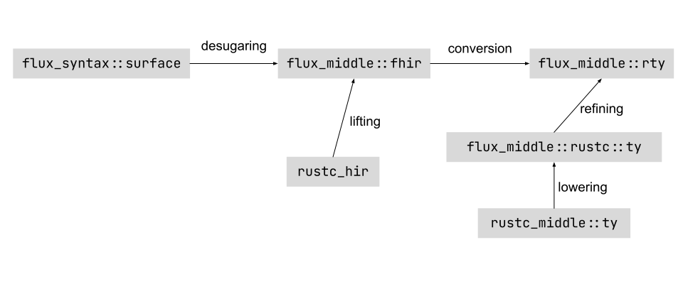

# High-level Architecture

Flux is implemented as a compiler [driver](https://rustc-dev-guide.rust-lang.org/rustc-driver.html?highlight=Callbacks%5C#rustc_driver-and-rustc_interface). We hook into the compiler by implementing the [`Callbacks`](https://doc.rust-lang.org/nightly/nightly-rustc/rustc_driver/trait.Callbacks.html) trait. The implementation is located is in the `flux-driver` crate, and it is the main entry point to Flux.

## Crates

- `crates/flux-bin`: Contains the `cargo-flux` and `rustc-flux` binaries used to launch the `flux-driver`.
- `crates/flux-common`: Common utility definitions used across all crates.
- `crates/flux-config`: Crate containing logic associated with global configuration flags that change the behavior of Flux, e.g, to enable or disable overflow checking.
- `crates/flux-desugar`: Implementation of name resolution and desugaring from Flux surface syntax into Flux high-level intermediate representation (`fhir`). This includes name resolution.
- `crates/flux-driver`: Main entry point to Flux. It contains the `flux-driver` binary and the implementation of the [`Callbacks`](https://doc.rust-lang.org/nightly/nightly-rustc/rustc_driver/trait.Callbacks.html) trait.
- `crates/flux-errors`: Utility definitions for user facing error reporting.
- `crates/flux-fhir-analysis`: Implements the "analyses" performed in the `fhir`, most notably well-formedness checking and conversion from `fhir` into `rty`.
- `crates/flux-fixpoint`: Code to interact with the Liquid Fixpoint binary.
- `crates/flux-macros`: Procedural macros used internally to implement Flux.
- `crates/flux-metadata`: Logic for saving Flux crate metadata that can be used to import refined signatures from external crates.
- `crates/flux-middle`: This crate contains common type definitions that are used by the rest of Flux like the `rty` and `fhir` intermediate representations. Akin to [`rustc_middle`](https://doc.rust-lang.org/nightly/nightly-rustc/rustc_middle/index.html).
- `crates/flux-refineck`: Implementation of refinement type checking.
- `crates/flux-syntax`: Definition of the surface syntax AST and parser.
- `tests`: Flux regression tests.
- `lib/flux-attrs`: Implementation of user facing procedural macros for annotating programs with Flux specs.
- `lib/flux-rs`: This is just a re-export of the macros implemented in `flux-attrs`. The intention is to eventually put Flux "standard library" here, i.e., a set of definitions that are useful when working with Flux.

## Intermediate Representations

Flux has several intermediate representations (IR) for types. They represent a refined version of an equivalent type in some `rustc` IR. We have picked a distinct *verb* to refer to the process of going between these different representations to make it easier to refer to them. The following image summarizes all the IRs and the process for going between them.

### Surface

The surface IR represents source level Flux annotations. It corresponds to the [`rustc_ast`](https://doc.rust-lang.org/nightly/nightly-rustc/rustc_ast/index.html) data structures in `rustc`. The definition as well as the parser is located in the `flux-syntax` crate.

### Fhir

The Flux High-Level Intermediate Representation (fhir) is a refined version of [`rustc`'s hir](https://doc.rust-lang.org/nightly/nightly-rustc/rustc_hir/index.html). The definition is located in the `flux_middle` crate inside the `fhir` module. The process of going from `surface` to `fhir` is called *desugaring*, and it is implemented in the `flux-desugar` crate.

### Rty

The definition in the `flux_middle::rty` module correspond to a refined version of the main `rustc` representation for types defined in [`rustc_middle::ty`](https://doc.rust-lang.org/nightly/nightly-rustc/rustc_middle/ty/index.html). The process of going from `fhir` to `rty` is called *conversion*, and it is implemented in the `flux_fhir_analysis::conv` module.

### Simplified Rustc

The definition in the `flux_middle::rustc` module correspond to simplified version of data structures in `rustc`. They can be understood as the currently supported subset of Rust. The process of going from a definition in `rustc_middle` into `flux_middle::rustc` is called *lowering* and it is implemented in `flux_middle::rustc::lowering`.

### Lifting and Refining

Besides the different translation between Flux intermediate representations, there are two ways to get a refined version from a rust type. The process of going from a type in `hir` into a type in `fhir` is called *lifting*, and it is implemented in `flux_middle::fhir::lift`. The process for going from a type in `flux_middle::rustc::ty` into a `flux_middle::rty` is called *refining*, and it is implemented `flux_middle::rty::refining`.
