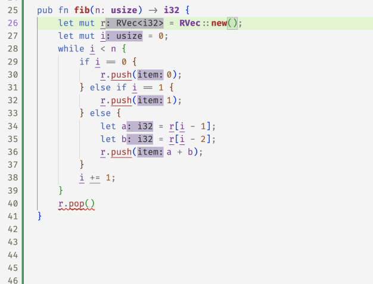

# Opaque Types: Refined Vectors

```rust, editable, hidden
#![allow(unused)]
extern crate flux_rs;
use flux_rs::attrs::*;

#[flux_rs::spec(fn (bool[true]))]
fn assert(b: bool) {
    if !b {
        panic!("assertion failed");
    }
}
```

[Online demo](https://flux.goto.ucsd.edu/index.html#?demo=vectors.rs)

While `rustc` has a keen eye for spotting nasty bugs at
compile time, it is not omniscient. We've all groaned in
dismay at seeing deployed code crash with messages like

```
panicked at 'index out of bounds: the len is ... but the index is ...'
```

Next, lets see how flux's [refinement](./01-refinements.md)
and [ownership](./02-ownership.md) mechanisms let us write
a _refined vector_ API whose types track vector sizes and
ensure --- at compile time --- that vector accesses cannot
fail at runtime.

<!-- SLIDE -->

## Refining Vectors ...

To track sizes, lets define a `struct` that
is just a _wrapper_ around the `std::vec::Vec`
type, but with a refinement index that tracks
the size of the vector.

```rust, editable
#[opaque]
#[refined_by(len: int)]
pub struct RVec<T> {
    inner: Vec<T>,
}
```

<!-- SLIDE -->

### ... to Track their Size

As [with other structs](./03-structs.md) we're using `refined_by`
to _index_ the `RVec` with an `int` value (that will represent
the vector's length.)

The idea is that

- `RVec<i32>[10]` represents a vector of `i32` size 10, and
- `RVec<bool>{v:0 < v}` represents a _non-empty_ vector of `bool`, and
- `RVec<RVec<f32>[n]>[m]` represents a vector of vectors of `f32` of size `m` and
  _each of_ whose elements is a vector of size `n`.

<!-- SLIDE -->

### ... but _Opaquely_

The `opaque` attribute tells flux that we're not
going to _directly_ connect the `len` to any of
the `RVec`'s fields' values.

This is quite _unlike_ [`Positivei32` example](./03-structs.md)
where the index held the actual value of the field,
or the [`Timer` example)(./04-enums.md) where the
index held the value of the countdown.

Instead, with an _opaque_ `struct` the idea is that the value
of the index will be tracked solely by the API for that struct.

Next, lets see how to build such an API for creating and
manipulating `RVec`, where the length is precisely tracked
in the index.

<!-- SLIDE -->

### Creating Vectors

I suppose one must start with nothing: the empty vector.

```rust, editable
#[trusted]
impl<T> RVec<T> {
    #[spec(fn() -> RVec<T>[0])]
    pub fn new() -> Self {
        Self { inner: Vec::new() }
    }
}
```

The above implements `RVec::new` as a wrapper around `Vec::new`.
The `#[trusted]` attribute tells flux to _not check_ this code,
i.e. to simply _trust_ that the specification is correct.
Indeed, flux _cannot_ check this code.

If you remove the `#trusted` (do it!) then flux will
complain that you _cannot_ access the `inner` field
of the opaque `struct`!

So the only way to use an `RVec` is to define a "trusted" API,
and then use that in client code, where for example, callers
of `RVec::new` get back an `RVec` indexed with `0` : the empty vector.

<!-- SLIDE -->

### Pushing Values

An empty vector is a rather desolate thing.

To be of any use, we need to be able to `push`
values into it, like so

```rust, editable
#[trusted]
impl<T> RVec<T> {
    #[spec(fn(self: &mut RVec<T>[@n], T) ensures self: RVec<T>[n+1])]
    pub fn push(&mut self, item: T) {
        self.inner.push(item);
    }
}
```

The refined type for `push` says that it takes a [_updatable_ reference](./02-ownership.md#borrowing-updatable-references) to an `RVec<T>` of size `n` and, a value `T`
and ensures that upon return, the size of `self` is increased by `1`.

### Creating a Vector with `push`

Lets test that the types are in fact tracking sizes.

```rust, editable
#[spec(fn () -> RVec<i32>[3])]
fn test_push() -> RVec<i32> {
    let mut v = RVec::new(); // v: RVec<i32>[0]
    v.push(1);               // v: RVec<i32>[1]
    v.push(2);               // v: RVec<i32>[2]
    v.push(3);               // v: RVec<i32>[3]
    v
}
```

**EXERCISE**: Can you correctly implement the code
for `zeros` so that it typechecks?

```rust, editable
#[spec(fn(n: usize) -> RVec<i32>[n])]
fn zeros(n:usize) -> RVec<i32> {
    let mut v = RVec::new(); // v: RVec<i32>[0]
    let mut i = 0;
    while i <= n {
        v.push(0);           // v: RVec<i32>[i]
        i += 1;
    }
    v
}
```

### Popping Values

Not much point stuffing things into a vector if we can't get them out again.
For that, we might implement a `pop` method that returns the _last_ element
of the vector.

Aha, but what if the vector is empty? You _could_ return an
`Option<T>` _or_ since we're tracking sizes, we could
_require_ that `pop` only be called with non-empty vectors.

```rust, editable
#[trusted]
impl<T> RVec<T> {
    #[spec(fn(self: &mut {RVec<T>[@n] | 0 < n}) -> T
           ensures self: RVec<T>[n-1])]
    pub fn pop(&mut self) -> T {
      self.inner.pop().unwrap()
    }
}
```

Note that unlike `push` which works for _any_ `RVec<T>[@n]`, the `pop`
method requires that `0 < n` i.e. that the vector is _not_ empty.

### Using the `push/pop` API

Now already `flux` can start checking some code, for example if you `push` two
elements, then you can `pop` twice, but flux will reject the third `pop` at
compile-time

```rust, editable
fn test_push_pop() {
    let mut vec = RVec::new();   // vec: RVec<i32>[0]
    vec.push(10);                // vec: RVec<i32>[1]
    vec.push(20);                // vec: RVec<i32>[2]
    vec.pop();                   // vec: RVec<i32>[1]
    vec.pop();                   // vec: RVec<i32>[0]
    vec.pop();                   // rejected!
}
```

In fact, the error message from `flux` will point to exact condition that
does not hold

```rust
error[FLUX]: precondition might not hold
   |
24 |     v.pop();
   |     ^^^^^^^ call site
   |
   = note: a precondition cannot be proved at this call site
note: this is the condition that cannot be proved
   |
78 |     #[spec(fn(self: &mut{RVec<T>[@n] | 0 < n}) -> T
   |                                        ^^^^^
```

<!--
We can use `push` to implement an `rvec!` macro for constructing vectors
and then test that lengths are tracked correctly

 -->

<!-- SLIDE -->

### Querying the Size

Perhaps we should _peek_ at the size of the vector
to make sure its not empty _before_ we `pop` it.

We can do that by writing a `len` method that returns
a `usize` corresponding to (and hence, by indexed by)
the size of the input vector

```rust, editable
#[flux_rs::trusted]
impl<T> RVec<T> {
    #[spec(fn(&RVec<T>[@vec]) -> usize)]
    pub fn len(&self) -> usize {
        self.inner.len()
    }
}
```

**EXERCISE** Can you fix the `spec` for `len` so that the code below
verifies, i.e. so that flux "knows" that

- after two `push`es, the value returned by `.len()` is exactly `2`, and
- after two `pop`s the size is `0` again.

```rust, editable
fn test_len() {
    let mut vec = RVec::new();
    vec.push(10);
    vec.push(20);
    assert(vec.len() == 2);
    vec.pop();
    vec.pop();
    assert(vec.len() == 0);
}
```

<!-- SLIDE -->

## Random Access

Of course, vectors are not just _stacks_, they also allow
_random_ access to their elements which is where those
pesky panics occur, and where the refined vector API
gets rather useful.

Now that we're tracking sizes, we can _require_
that the method to `get` an element only be called
with a _valid index_ less than the vector's size

```rust, editable
impl<T> RVec<T> {
    #[spec(fn(&RVec<T>[@n], i: usize{i < n}) -> &T)]
    pub fn get(&self, i: usize) -> &T {
        &self.inner[i]
    }

    #[spec(fn(&mut RVec<T>[@n], i: usize{i < n}) -> &mut T)]
    pub fn get_mut(&mut self, i: usize) -> &mut T {
        &mut self.inner[i]
    }
}
```

<!-- SLIDE -->

### Summing the Elements of an `RVec`

**EXERCISE** Can you spot and fix the _off-by-one_ error
in the code below which loops over the elements
of an `RVec` and sums them up? [^1]

```rust, editable
fn sum_vec(vec: &RVec<i32>) -> i32 {
    let mut res = 0;
    let mut i = 0;
    while i <= vec.len() {
        res += vec.get(i);
        i += 1;
    }
    sum
}
```

<!-- SLIDE -->

### Using the `Index` trait

Its a bit of an eyesore to to use `get` and `get_mut` directly.

Instead lets implement the `Index` and `IndexMut`
traits for `RVec` which allows us to use the `[..]`
operator to access elements

```rust, editable
impl<T> std::ops::Index<usize> for RVec<T> {
    type Output = T;
    #[spec(fn(&RVec<T>[@n], i:usize{i < n}) -> &T)]
    fn index(&self, index: usize) -> &T {
        self.get(index)
    }
}

impl<T> std::ops::IndexMut<usize> for RVec<T> {
    #[spec(fn(&mut RVec<T>[@n], i:usize{i < n}) -> &mut T)]
    fn index_mut(&mut self, index: usize) -> &mut T {
        self.get_mut(index)
    }
}
```

<!-- SLIDE -->

### Summing Nicely

Now the above `vec_sum` example looks a little nicer

```rust, editable
fn sum_vec_fixed(vec: &RVec<i32>) -> i32 {
    let mut res = 0;
    let mut i = 0;
    while i < vec.len() {
        res += vec[i]
        i += 1;
    }
    sum
}
```

<!-- SLIDE -->

## Memoization

Lets put the whole API to work in this "memoized" version of the fibonacci
function which uses a vector to store the results of previous calls

```rust, editable
pub fn fib(n: usize) -> i32 {
    let mut r = RVec::new();
    let mut i = 0;
    while i < n {
        if i == 0 {
            r.push(0);
        } else if i == 1 {
            r.push(1);
        } else {
            let a = r[i - 1];
            let b = r[i - 2];
            r.push(a + b);
        }
        i += 1;
    }
    r.pop()
}
```

**EXERCISE** Flux is unhappy with the `pop` at the end of the function
which returns the _last_ value as the result: it thinks the vector
_may be empty_ and so the `pop` call may fail ... Can you spot and fix
the problem?

```rust
error[FLUX]: precondition might not hold
  --> src/vectors.rs:40:5
   |
40 |     r.pop()
   |     ^^^^^^^
```

<!-- Indeed, we missed a "corner" case -- when `n` is `0` we skip the loop and
so the vector is empty! Once we add a test for that, flux is happy.

 -->

<!-- SLIDE -->

## Binary Search

As a last example, lets look at a simplified version of the
[`binary_search` method from `std::vec`][bsearch], into which
we've snuck a tiny little bug

```rust, editable
pub fn binary_search(vec: &RVec<i32>, x: i32) -> Result<usize, usize> {
    let mut size = vec.len();
    let mut left = 0;
    let mut right = size;
    while left <= right {
        let mid = left + size / 2;
        let val = vec[mid];
        if val < x {
            left = mid + 1;
        } else if x < val {
            right = mid;
        } else {
            return Ok(mid);
        }
        size = right - left;
    }
    Err(left)
}
```

Flux complains in _two_ places

```rust
error[FLUX]: precondition might not hold
   --> src/vectors.rs:152:19
    |
152 |         let val = vec[mid];
    |                   ^^^^^^^^ call site
    |
    = note: a precondition cannot be proved at this call site
note: this is the condition that cannot be proved
   --> src/rvec.rs:189:44
    |
189 |     #[spec(fn(&RVec<T>[@n], usize{v : v < n}) -> &T)]
    |                                       ^^^^^

error[FLUX]: arithmetic operation may overflow
   --> src/vectors.rs:160:9
    |
160 |         size = right - left;
    |         ^^^^^^^^^^^^^^^^^^^
```

- The vector access may be _unsafe_ as `mid` could be out of bounds!

- The `size` variable may _underflow_ as `left` may exceed `right`!

**EXERCISE** Can you the spot off-by-one and figure out a fix?

## Summary

Well then. We just saw how Flux's index and constraint
mechanisms combine with Rust's ownership to let us write
a _refined vector API_ that ensures the safety of all
accesses at compile time.

These mechanisms are _compositional_ : we can use standard
type machinery to build up compound structures and APIs from
simple ones, as we will see when we use `RVec` to implment
[sparse matrices](./10-case-study-sparse.md) and a small
[neural network](./12-case-study-neural.md) library.

[^1]: Why not use an iterator? We'll get there in [due course](./07-traits.md)!

[bsearch]: https://doc.rust-lang.org/src/core/slice/mod.rs.html#2423-2425
