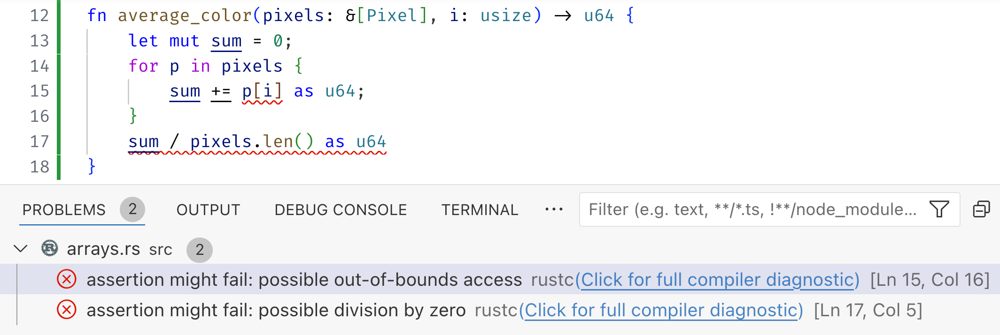
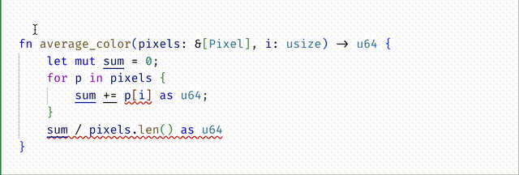
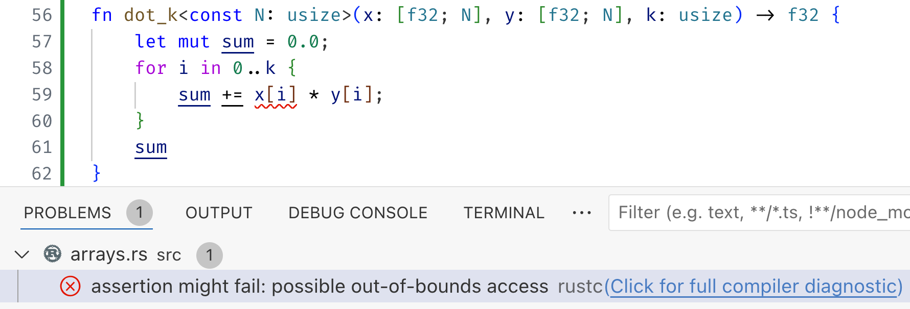
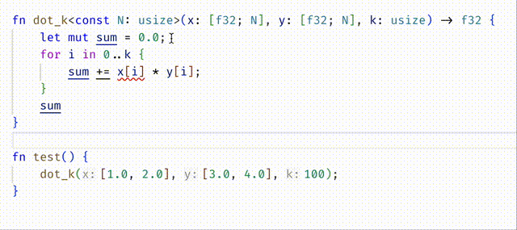
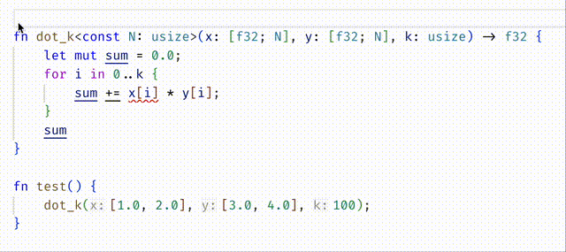

# Const Generics

[Online demo](https://flux.goto.ucsd.edu/index.html#?demo=arrays.rs)

Rust has a built-in notion of _arrays_ : collections of objects of
the same type `T` whose size is known at compile time. The fact that
the sizes are known allows them to be allocated contiguously in memory,
which makes for fast access and manipulation.

When I asked ChatGPT what arrays were useful for, it replied
with several nice examples, including low-level systems programming (e.g.
packets of data represented as `struct`s with array-valued fields), storing configuration data, or small sets of related values (e.g. RGB values for a pixel).

```rust
type Pixel = [u8; 3]; // RGB values

let pix0: Pixel = [255,   0, 127];
let pix1: Pixel = [  0, 255, 127];
```

## Compile-time Safety...

As the size of the array is known at compile time, Rust can make sure that
we don't _create_ arrays of the wrong size, or _access_ them out of bounds.

For example, `rustc` will grumble if you try to make a `Pixel` with 4 elements:

```rust
   |
52 | let pix2 : Pixel = [0,0,0,0];
   |            -----   ^^^^^^^^^ expected an array with a fixed size of 3 elements, found one with 4 elements
   |            |
   |            expected due to this
```

Similarly, `rustc` will wag a finger if you try to access a `Pixel` at an invalid index.

```rust
   |
54 |  let blue0 = pix0[3];
   |              ^^^^^^^ index out of bounds: the length is 3 but the index is 3
   |
```

## ... Run-time Panic!

However, the plain type system works only upto a point. For example, consider the
following function to compute the average `color` value of a collection of `&[Pixel]`

```rust
fn average_color(pixels: &[Pixel], i: usize) -> u64 {
    let mut sum = 0;
    for p in pixels {
        sum += p[i] as u64;
    }
    sum / pixels.len() as u64
}
```

Now, `rustc` will not complain about the above code, even though it may panic if
`color` is out of bounds (or of course, if the slice `pixels` is empty!).
For example, the following code

```rust
fn main() {
    let pixels = [ [255, 0, 0], [0, 255, 0], [0, 0, 255] ];
    let avg = average(&pixels, 3);
    println!("Average: {}", avg);
}
```

panics at runtime:

```
thread 'main' panicked ... index out of bounds: the len is 3 but the index is 3
```

## Refined Compile-time Safety

Fortunately, `flux` knows about the sizes of arrays and slices. At compile time,
`flux` warns about two possible errors in `average_color`



1. The index `i` may be out of bounds when accessing `p[i]` and
2. The division can panic as `pixels` may be empty (i.e. have length `0`).

We can fix these errors by requiring that the input

- `i` be a valid color index, i.e. `i < 3` and
- `pixels` be non-empty, i.e. have size `n` where `n > 0`

```rust
#[sig(fn(pixels: &[Pixel][@n], i:usize{i < 3}) -> u64 requires n > 0)]
```



## Const Generics

Rust also lets us write arrays that are _generic_ over the size. For example,
suppose we want to take two input arrays `x` and `y` of the same size `N` and
compute their dot product. We can write

```rust
fn dot<const N:usize>(x: [f32;N], y: [f32;N]) -> f32 {
    let mut sum = 0.0;
    for i in 0..N {
        sum += x[i] * y[i];
    }
    sum
}
```

This is very convenient because `rustc` will prevent us from calling `dot` with
arrays of different sizes, for example we get a compile-time error

```rust
   |
68 |     dot([1.0, 2.0], [3.0, 4.0, 5.0]);
   |     ---             ^^^^^^^^^^^^^^^ expected an array with a fixed size of 2 elements, found one with 3 elements
   |     |
   |     arguments to this function are incorrect
   |
```

However, suppose we wanted to compute the `dot` product of just the first `k` elements

```rust
fn dot_k<const N:usize>(x: [f32;N], y: [f32;N], k: usize) -> f32 {
    let mut sum = 0.0;
    for i in 0..k {
        sum += x[i] * y[i];
    }
    sum
}
```

Now, unfortunately, `rustc` will not prevent us from calling `dot_k` with `k` set to a value that is too large!

```rust
thread 'main' panicked at ... index out of bounds: the len is 2 but the index is 2
```

Yikes.

## Refined Const Generics

Fortunately, `flux` understands const-generics as well!

First off, it warns us about the fact that the accesses with the index may be out of bounds.



We can fix it in two ways.

- The **permissive** approach is to accept any `k` but restrict the iteration to the valid elements

```rust
fn dot_k<const N:usize>(x: [f32;N], y: [f32;N], k: usize) -> f32 {
    let mut sum = 0.0;
    let n = if k < N { k } else { N };
    for i in 0..n {
        sum += x[i] * y[i];
    }
    sum
}
```



- The **strict** approach is to require that `k` be less than or equal to `N`

```rust
#[sig(fn(x: [f32;N], y: [f32;N], k:usize{k <= N}) -> f32)]
fn dot_k<const N:usize>(x: [f32;N], y: [f32;N], k: usize) -> f32 {
    let mut sum = 0.0;
    for i in 0..k {
        sum += x[i] * y[i];
    }
    sum
}
```



Do you understand why

(1) Adding the type signature moved the error from the body of `dot_k` into the call-site inside `test`?
(2) Then editing `test` to call `dot_k` with `k=2` fixed the error?

## Summary

Rust's (sized) arrays are great, and `flux`'s refinements make them even better,
by ensuring indices are guaranteed to be within the arrays bounds. Const generics
let us write functions that are polymorphic over array sizes, and again, refinements
let us precisely track those sizes to prevent out-of-bounds errors!
