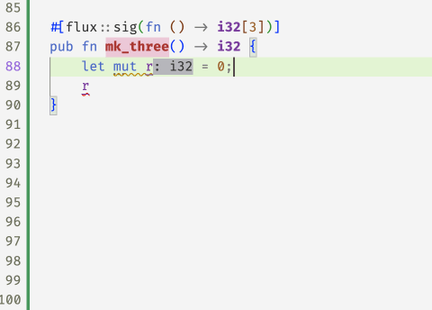

# Ownership in Flux

[Online demo](http://goto.ucsd.edu:8091/index.html#?demo=ownership.rs)

[Previously][blog-intro] we saw how to refine basic Rust
types like `i32` and `bool` with *indices* and *constraints* to
constrain the set of values described by those types.

The whole point of Rust, of course, is to allow for efficient
imperative *sharing* and *updates*, via the clever type system
that keeps an eye on the *ownership* of resources to make sure
that aliasing and mutation cannot happen at the same time.

Next, lets see how Flux melds refinements and Rust's ownership
mechanisms to make refinements work in the imperative setting.

## Exclusive Ownership

Rust's most basic form of ownership is *exclusive* ownership,
in which exactly one variable in a function has the right to
mutate a memory location. When a location is exclusively
owned, we can be sure that there are *no other references*
to it, which lets flux *update* the type whenever the location
is changed. For example, consider the program

```rust
#[flux::sig(fn () -> i32[3])]
pub fn mk_three() -> i32 {
    let mut r = 0;  // r: i32[0]
    r += 1;
    assert(r == 1); // r: i32[1]
    r += 1;
    assert(r == 2); // r: i32[2]
    r += 1;
    assert(r == 3); // r: i32[3]
    r
}
```

The variable `r` has *different types* at each point inside `mk_three`.
It starts off as `i32[0]`. The first increment changes it to `i32[1]`,
then `i32[2]` and finally, the returned type `i32[3]`.



This exclusive ownership mechanism is at work in the `factorial` example
we signed off with [previously][blog-intro]

```rust
#[flux::sig(fn (n:i32{0 <= n}) -> i32{v:n <= v})]
pub fn factorial(n: i32) -> i32 {
    let mut i = 0;  // i: i32[0]
    let mut r = 1;  // r: i32[1]
    while i < n {
                    // i: i32{v:0<=v<=n}
                    // r: i32{v:1<=v && i<=v}
        i += 1;
        r = r * i;
    }
    r
}
```

In the above code, `i` and `r` start off at `0` and `1` but then
Rust *infers* (a story for another day) that inside the `while`-loop[^1]

* `i` has type `i32{v:0<=v && v < n}`
* `r` has type `i32{v:1<=v && i <= v}`

and hence, upon exit since `i == n` we get that the result is at least `n`.


## Borrowing: Shared References

Exclusive ownership suffices for simple local updates like in `factorial`.
However, for more complex data, functions must temporarily relinquish
ownership to allow *other* functions to mutate the data. Rust cleverly
allows this via the notion of *borrowing* using two kinds of references
that give callees temporary access to a memory location.

The simplest kind of references are of the form `&T` which denote *read-only*
access to a value of type `T`. For example, we might write `abs` to take
a shared reference to an `i32`

```rust
#[flux::sig(fn (p: &i32[@n]) -> i32{v:0<=v && n<=v})]
pub fn abs(p: &i32) -> i32 {
    let n = *p;
    if 0 <= n {
        n
    } else {
        0 - n
    }
}
```

Notice that the *input* type has changed: the function now

* Accepts `p` a *reference* to an `i32` whose value is `n` as denoted by `@n`
* Returns an `i32` that is non-negative and larger than `n`

The `@` marks the `n` as a *refinement parameter* whose value
is automatically computed by flux during type checking.

So, for example, Flux can check the below code by automatically
determining that the refinement parameter at the call-site is `10`.

```rust
pub fn test_abs() {
    let z = 10;
    assert(0 <= abs(&z))
    assert(10 <= abs(&z))
}
```

### Refinement Parameters

As an aside, we have secretly been using *refinement parameters*
like `@n` all along. For example, Flux automatically *desugars* the signature `fn(n:i32{0 <= n} -> ...` that we wrote for `factorial` into

```rust
fn ({i32[@n] : 0 <= n}) -> i32{v:n <= v}
```

where `@n` is a refinement parameter that is _implicitly_ determined
from the rust parameter `n:i32`. However, _explicit_ parameters are
essential to *name* the value of what a reference points to.
In `abs` the `rust` parameter `p` names the reference but the
`@n` names the (input) _value_ and lets us use it to provide
more information about the output of `abs`.

Flux is _modular_ in that the _only_ information it
knows about the implementation of `abs` is the signature: for example
if we remove the fact that the output exceeds `n` then Flux will
reject the assertion `10 <= abs(&z)`.


## Borrowing: Mutable References

References of type `&mut T` denote *mutable* references that can be
used to (read and) write or update the contents of a `T` value.
Crucially, Rust ensures that while there may be multiple read-only (shared)
references to a location, there is at most one _active_ writeable (mutable)
reference at any point in time.

Flux exploits the semantics of `&mut T` to treat `T` as an *invariant*
of the underlying data. As an example, consider the following function
that *decrements* the value of a mutable reference while ensuring the
data is non-negative:

```rust
#[flux::sig(fn(p: &mut i32{v:0 <= v}))]
pub fn decr(p: &mut i32) {
    *p = *p - 1;
}
```

Flux will complain with the following message

```rust
error[FLUX]: assignment might be unsafe
  --> src/basics.rs:13:9
   |
13 |         *p = *p - 1;
   |         ^^^^^^^^^^^
```

as in fact, we *may* be writing a negative value into `*p`
if, for example, the old value was zero. We can fix this
code by guarding the update with a test that ensures the
original contents are in fact *non-zero*

```rust
#[flux::sig(fn(p: &mut i32{v:0 <= v}))]
pub fn decr(p: &mut i32) {
    let n = *p;
    if n != 0 {
        *p = n - 1;
    }
}
```

at which point Flux is happy to sign off on the code.


## Aliased References

Flux uses Rust's borrowing rules to track invariants even when
there may be aliasing. As an example, consider the function

```rust
#[flux::sig(fn (bool) -> i32{v:0 <= v})]
fn test_alias(z: bool) -> i32 {
    let mut x = 1;  // x: i32[1]
    let mut y = 2;  // y: i32[2]
    let r = if z { &mut x } else { &mut y };
                    // r: &mut i32{v:0 <= v}
    decr(r);
    *r
}
```

The reference `r` could point to *either* `x` or `y` depending
on the (unknown) value of the boolean `z`. Nevertheless, Flux
determines that *both* references `&mut x` and `&mut y` point
to values of the more general type `i32{v:0<=v}` and hence,
infers `r : &mut i32{v:0<=v}` which allows us it to then call
`decr` with the reference and guarantee the result (after `decr`)
is still non-negative.


## Borrowing: Strong References

In many situations, we want to lend a value to another function
that actually *changes* the value's (refinement) type upon exit.
For example, consider the following function to increment a reference
to a non-negative `i32`

```rust
#[flux::sig(fn (p: &mut i32{v:0 <= v}))]
fn incr(p: &mut i32) {
  *p += 1
}
```

Recall that Flux is _modular_ in that the _only_ information it
has about `incr` is what is said in the signature. The signature
for `incr` only says `p` remains non-negative: Flux does *not*
know that `incr` actually *increments* the value of `p`.

Hence, Flux fusses that the following `assert` may fail even though
its patently obvious that it will succeed!


To verify `test_incr` we need a signature for `incr` that says
that its *output* is indeed one greater[^2] than its input.
Flux extends Rust with the notion of **strong references**
of the form `&strg T` which refine Rust's `&mut T` to grant
_exclusive_ access to the underlying `T`. Crucially, strong
references also let us specify how the type is _updated_ when
the function exits[^3]. Thus, we can use strong references to
type `incr` as

```rust
#[flux::sig(fn(p: &strg i32[@n]) ensures p:i32[n+1])]
fn incr(p: &mut i32) {
  *p += 1
}
```

The Flux signature refines the plain Rust one to specify that

1. `p` is a strong reference to an `i32`,
2. the *input type* of `*p` is `i32[n]`, and
2. the *output type* of `*p` is `i32[n+1]`.

With this specification, Flux merrily checks `test_incr`, by
determining that the refinement parameter `@n` is `10` and
hence, that upon return `x: i32[11]`.

## Summary

To sum up, Flux exploits Rust's ownership mechanisms to track properties
of *shared* (`&T`) and *mutable* (`&mut T`) references, and additionally
adds a *strong* (`&strg T`) reference -- a special case of `&mut` -- to
support the cases where the type itself is *changed* by a call.

Next, we'll see how refinements and ownership yield a simple refined API
for _vectors_ that lets Flux check bounds safety at compile time...

[^1]: For those familiar with the term, these types are *loop invariants*
[^2]: Setting aside the issue of overflows for now
[^3]: Thereby allowing so-called *strong updates* in the type specifications

[blog-intro]: https://liquid-rust.github.io/2022/11/14/introducing-flux/
