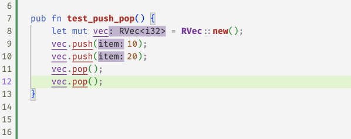

# Refined Vectors

[Online demo](http://goto.ucsd.edu:8091/index.html#?demo=vectors.rs)

While `rustc` has a keen eye for spotting nasty bugs at
compile time, it is not omniscient. We've all groaned in
dismay at seeing deployed code crash with messages like

```
panicked at 'index out of bounds: the len is ... but the index is ...'
```

Next, lets see how flux's [refinement][blog-intro] and [ownership][blog-owners]
mechanisms let us write a *refined vector* API whose types track vector sizes
and ensure --- at compile time --- that vector accesses *cannot* fail at runtime.


## Refining Vectors to Track their Size

To begin with, we will defined a *refined* vector type which is simply a wrapper
around the standard `Vec` type

```rust
#[flux::refined_by(len: int)]
pub struct RVec<T> {
    inner: Vec<T>,
}
```

The `#[flux::refined_by(len: int)]` attribute tells flux that the type `RVec<T>` struct
is indexed by a `len` refinement which tracks the *size* of the underlying vector, just
like the indices for `i32` and `bool` tracked the actual *value* of the underlying
[integer or boolean][blog-intro]). The idea is that the type

* `RVec<i32>[10]` represents a vector of `i32` size 10, and
* `RVec<bool>{v:0 < v}` represents a *non-empty* vector of `bool`, and
* `RVec<RVec<f32>[n]>[m]` represents a vector of vectors of `f32` of size `m` and
   *each of* whose elements is a vector of size `n`.

### Creating Vectors

Now that we can talk about the size of a vector, lets build up an API for creating and
manipulating vectors. I suppose one must start with nothing: an empty vector.

```rust
impl<T> RVec<T> {
    #[flux::trusted]
    #[flux::sig(fn() -> RVec<T>[0])]
    pub fn new() -> Self {
        Self { inner: Vec::new() }
    }
}
```

The above implements `RVec::new` as a wrapper around `Vec::new`.
The `#[flux::trusted]` attribute tells Flux there is nothing to
"check" here, as we are *defining* the API itself and trusting
that the implementation (using `vec` is correct).
However, the signature says that *callers* of the `RVec::new` get
back a vector indexed with `0` i.e. an empty vector.

### Pushing Values

An empty vector is a rather desolate thing.

To be of any use, we need to be able to `push` values into the container, like so

```rust
#[flux::trusted]
#[flux::sig(fn(self: &strg RVec<T>[@n], T)
            ensures self: RVec<T>[n+1])]
pub fn push(&mut self, item: T) {
    self.inner.push(item);
}
```

The refined type for `push` says that it takes a *strong* reference (`self`)
--- where `strg` means the refined type may be [changed by the function](blog-owners) ---
to an `RVec<T>` of size `n` and a value `T` and upon exit, the size of `self`
is increased by `1`.


### Popping Values

Not much point stuffing things into a vector if we can't get them out again.

For that, we might implement a `pop` method that returns the last element
of the vector. Aha, but what if the vector is empty? You could return an
`Option<T>` *or* since we're tracking sizes, we could *require* that `pop`
only be called with non-empty vectors.

```rust
#[flux::trusted]
#[flux::sig(fn(self: &strg {RVec<T>[@n] | 0 < n}) -> T
            ensures self: RVec<T>[n-1])]
pub fn pop(&mut self) -> T {
  self.inner.pop().unwrap()
}
```

### Using the API

Now already `flux` can start checking some code, for example if you `push` two
elements, then you can `pop` twice, but flux will reject the third `pop` at
compile-time



In fact, the error message from `flux` will point to exact condition that
does not hold

```rust
error[FLUX]: precondition might not hold
  --> src/vectors.rs:24:5
   |
24 |     v.pop();
   |     ^^^^^^^ call site
   |
   = note: a precondition cannot be proved at this call site
note: this is the condition that cannot be proved
  --> src/rvec.rs:78:47
   |
78 |     #[flux::sig(fn(self: &strg {RVec<T>[@n] | 0 < n}) -> T
   |                                               ^^^^^
```

### Querying the Size

Perhaps we should *peek* at the size of the vector to make sure its not empty *before*
we `pop` it. We can do that with a `len` method whose type says that the returned `usize`
is, in fact, the size of the input vector

```rust
#[flux::trusted]
#[flux::sig(fn(&RVec<T>[@n]) -> usize[n])]
pub fn len(&self) -> usize {
    self.inner.len()
}
```

Now, flux "knows" that after two `push`es, the size of the vector is `2` and after
the two `pop`s, the size is `0` again


### Random Access

Of course, vectors are not just *stacks*, they also allow
*random* access to their elements which is where those
pesky panics occur, and where the refined vector API
gets rather useful. Since we're tracking sizes, we can
*require* that the method to `get` an element only be
called with a *valid index* that is between `0` and the
vector's size

```rust
#[flux::sig(fn(&RVec<T>[@n], i: usize{i < n}) -> &T)]
pub fn get(&self, i: usize) -> &T {
    &self.inner[i]
}

#[flux::sig(fn(&mut RVec<T>[@n], i: usize{i < n}) -> &mut T)]
pub fn get_mut(&mut self, i: usize) -> &mut T {
    &mut self.inner[i]
}
```

With these refined `get` methods, flux can now spot the
``off-by-one'' error in the following code and accepts
the fix [^1]


Its a bit gross to use `get` and `get_mut` directly, so instead we implement
the `Index` and `IndexMut` traits for `RVec` which allows us to use the
`[]` operator to access elements

```rust
impl<T> std::ops::Index<usize> for RVec<T> {
    type Output = T;
    #[flux::sig(fn(&RVec<T>[@n], i:usize{i < n}) -> &T)]
    fn index(&self, index: usize) -> &T {
        self.get(index)
    }
}

impl<T> std::ops::IndexMut<usize> for RVec<T> {
    #[flux::sig(fn(&mut RVec<T>[@n], i:usize{i < n}) -> &mut T)]
    fn index_mut(&mut self, index: usize) -> &mut T {
        self.get_mut(index)
    }
}
```

And now the above `vec_sum` example looks a little nicer


## Memoization

Lets put the whole API to work in this "memoized" version of the fibonacci
function which uses a vector to store the results of previous calls

```rust
pub fn fib(n: usize) -> i32 {
    let mut r = RVec::new();
    let mut i = 0;
    while i < n {
        if i == 0 {
            r.push(0);
        } else if i == 1 {
            r.push(1);
        } else {
            let a = r[i - 1];
            let b = r[i - 2];
            r.push(a + b);
        }
        i += 1;
    }
    r.pop()
}
```

Oops, flux is not happy with the call to `pop` at the end of the function
which returns the *last* value as the result.

```rust
error[FLUX]: precondition might not hold
  --> src/vectors.rs:40:5
   |
40 |     r.pop()
   |     ^^^^^^^
```

Flux complains that the vector may be *empty* and so the `pop` call may
fail ... but why? Can you spot the problem?

Indeed, we missed a "corner" case -- when `n` is `0` we skip the loop and
so the vector is empty! Once we add a test for that, flux is happy.


## Binary Search

As a last example, lets look at a simplified version of the
[`binary_search` method from `std::vec`][bsearch], into which I've snuck a tiny little bug

```rust
pub fn binary_search(vec: &RVec<i32>, x: i32) -> Result<usize, usize> {
    let mut size = vec.len();
    let mut left = 0;
    let mut right = size;
    while left <= right {
        let mid = left + size / 2;
        let val = vec[mid];
        if val < x {
            left = mid + 1;
        } else if x < val {
            right = mid;
        } else {
            return Ok(mid);
        }
        size = right - left;
    }
    Err(left)
}
```

Flux complains in *two* places

```rust
error[FLUX]: precondition might not hold
   --> src/vectors.rs:152:19
    |
152 |         let val = vec[mid];
    |                   ^^^^^^^^ call site
    |
    = note: a precondition cannot be proved at this call site
note: this is the condition that cannot be proved
   --> src/rvec.rs:189:44
    |
189 |     #[flux::sig(fn(&RVec<T>[@n], usize{v : v < n}) -> &T)]
    |                                            ^^^^^

error[FLUX]: arithmetic operation may overflow
   --> src/vectors.rs:160:9
    |
160 |         size = right - left;
    |         ^^^^^^^^^^^^^^^^^^^
```

- The vector access may be *unsafe* as `mid` could be out of bounds!

- The `size` variable may *underflow* as `left` may exceed `right`!

Can you the spot off-by-one and figure out a fix?


## Summary

So, we saw how Flux's index and constraint mechanisms combine
with Rust's ownership to let us write a *refined vector API*
that ensures the safety of all accesses at compile time.

Next time, we'll see how these mechanisms are *compositional*
in that we can use standard type machinery to build up
compound structures and APIs from simple ones.

[^1]: Why not use an iterator? We'll get there in due course!

[blog-intro]: https://liquid-rust.github.io/2022/11/14/introducing-flux/
[blog-owners]: https://liquid-rust.github.io/2022/11/16/ownership-in-flux/
[bsearch]: https://doc.rust-lang.org/src/core/slice/mod.rs.html#2423-2425