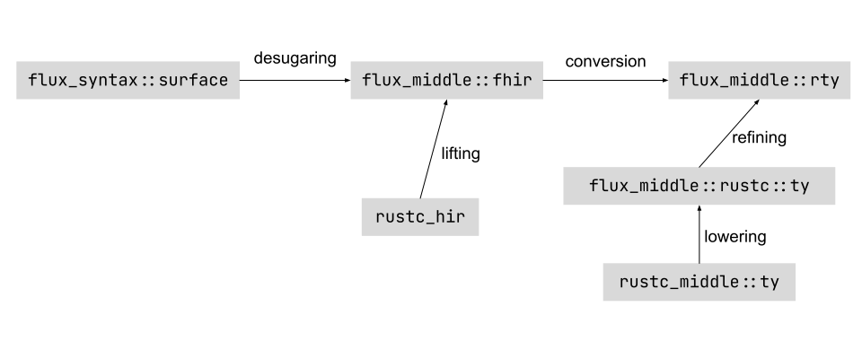

# High-level Architecture

Flux is implemented as a compiler [driver](https://rustc-dev-guide.rust-lang.org/rustc-driver.html?highlight=Callbacks%5C#rustc_driver-and-rustc_interface). We hook into the compiler by implementing the [`Callbacks`](https://doc.rust-lang.org/nightly/nightly-rustc/rustc_driver/trait.Callbacks.html) trait. The implementation is located is in the `flux-driver` crate, and it is the main entry point to Flux.

## Intermediate Representations

Flux has several intermediate representations (IR) for types. They represent a refined version of an equivalent type in `rustc` IRs. We have picked a distinct *verb* to refer to the process of going between these different representations to make it easier to refer to them.

### Surface

The surface IR represents source level Flux annotations. It corresponds to the [`rustc_ast`] data structures in `rustc`. The definition as well as the parser is located in the `flux-syntax` crate.

### Fhir

The Flux High-Level Intermediate Representation (fhir) is a refined version of the [`rustc`'s hir](https://doc.rust-lang.org/nightly/nightly-rustc/rustc_hir/index.html). The definition is located in the `flux_middle` crate inside the `fhir` module. The process of going from `surface` to `fhir` is called *desugaring*, and it is implemented in the `flux-desugar` crate.

### Rty

The definition in the `flux_middle::rty` module correspond to a refined version of the main `rustc` representation for types defined in [`rustc_middle::ty`](https://doc.rust-lang.org/nightly/nightly-rustc/rustc_middle/ty/index.html). The process of going from `fhir` to `rty` is called *conversion*, and it is implemented in the `flux-fhir-analysis::conv` module.

### Simplified Rustc

The definition in the `flux_middle::rustc` module correspond to simplified version of data structures in `rustc`. They can be understood as the currently supported subset of Rust. The process of going from a definition in `rustc_middle` into `flux_middle::rustc` is called *lowering* and it is implemented in `flux_middle::rustc::lowering`.

### Lifting and Refining

Besides the different translation between Flux intermediate representations, there are two ways to get a refined version from a rust type. The process of going from a type in `hir` into a type in `fhir` is called *lifting*, and it is implemented in `flux_middle::fhir::lift`. The process for going from a type in `flux_middle::rustc::ty` into a `flux_middle::rty` is called *refining*, and it is implemented `flux_middle::rty::refining`.
