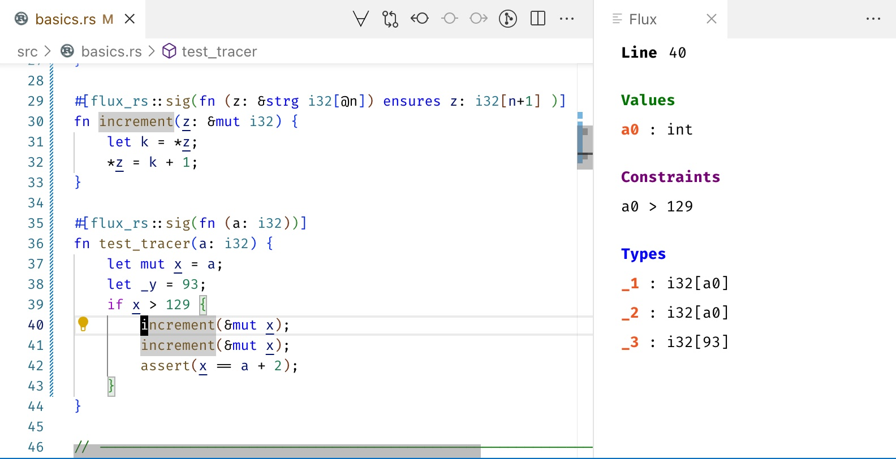
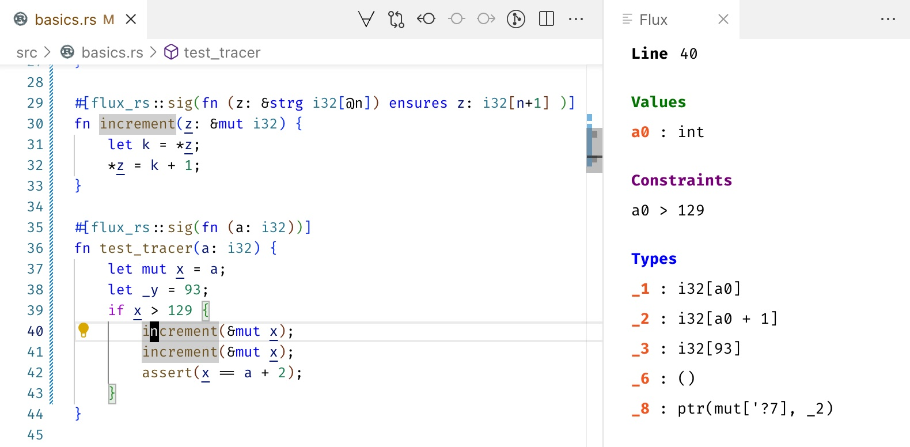

# Flux Refinement Type Checker

A VS Code extension for the **Flux Refinement Type Checker** for Rust, providing advanced type checking capabilities and interactive debugging features.

## Features

- **Interactive Type Checking**: Four-state switch to control checking scope (All/Mod/Def/Off)
- **Real-time Diagnostics**: Live error reporting with detailed type information
- **Trace Debugging**: Optional checker trace for detailed verification insights
- **Interactive UI**: Toggle between Values, Constraints, and Types views
- **Clickable Status Bar**: Cancel running operations with a simple click
- **Detached Link Navigation**: Jump between specifications and implementations



## Requirements

- **Flux Type Checker**: Follow the [installation guide](https://flux-rs.github.io/flux/guide/install.html)
- **Rust**: A Rust project with Flux annotations

## Installation

Install from the VS Code Marketplace or manually:

```bash
$ npm install -g vsce
$ vsce package
$ code --install-extension flux-checker-*.vsix
```

## Usage

1. Open a Rust project with Flux annotations
2. Use the command palette: **"Toggle Flux View"**
3. Configure checking mode using the four-state switch:
   - **All**: Check entire crate
   - **Mod**: Check current file only
   - **Def**: Check current function definition
   - **Off**: Disable checking
4. Enable **trace** checkbox for detailed debugging information

## Configuration

Set your custom Flux command in VS Code settings:

```json
{
  "flux.command": "cargo flux -p your-package"
}
```

## Contributing

This extension is part of the [Flux project](https://github.com/flux-rs/flux). Contributions welcome!

## License

MIT

You can then **enable** the extension by runnning the `Toggle Flux View` command in the command palette.

## Features

Flux View Panel: shows the types and environments known at each program point

- If your cursor is _at or before_ the first non-blank character of a line, the panel will show the types and environments _before_ that line
- Else the panel will show the types and environments _after_ that line



